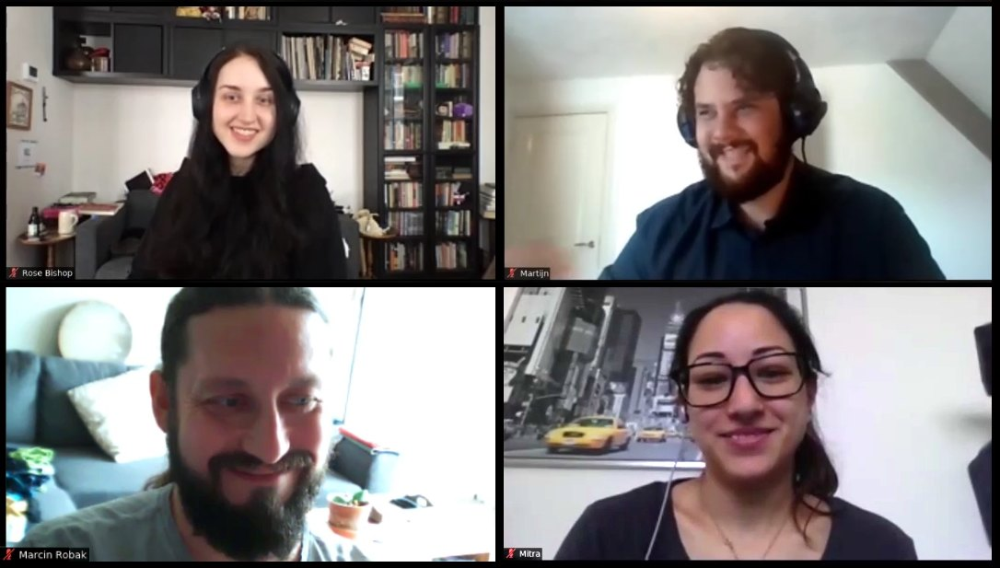
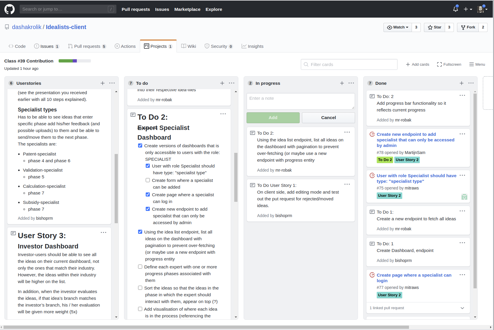

# [The Idealists](https://www.the-idealists.com/)

## Matching platform for investors and people with great ideas!

### See the site deployed here: [https://www.imaengine.io/](https://www.imaengine.io/)

---

## Overview

[The Idealists](https://www.the-idealists.com/) is an organization that matches investors and people with ideas that fit within the UN’s Sustainable Development Goals. We worked on their dashboard app that allows all parties involved - investors, experts, specialists, users, and admin - to engage with and develop approved ideas into new companies. [PDF](./readme-assets/the-Idealists.pdf)

---

### 👩‍💻👨‍💻 Who are we? 👨‍💻👩‍💻

We’re four full stack developers from the [Codaisseur](https://codaisseur.com/hire-developers/) Academy, coming from four different countries who teamed up to contribute to the Idealist project by implementing new features to an already existing codebase.

In no particular order:

**Rose Bishop (that's me!)** - [_github_](https://github.com/bishoprm), [_linkedin_](https://www.linkedin.com/in/rose-bishop-45a062193/)

**Mitra Wong Sokhandani** - [_github_](https://github.com/mitraws), [_linkedin_](https://www.linkedin.com/in/mitraws/)

**Martijn Samuels** - [_github_](https://github.com/MartijnSam), [_linkedin_](https://www.linkedin.com/in/martijnsamuels/)

**Marcin Robak** - [_github_](https://github.com/mr-robak), [_linkedin_](https://www.linkedin.com/in/marcin-robak-a98a3b1/)

---

### 🤓 Learning Goals: 🤓

- [✔️] Experience working on a real-world project with an client/product owner

- [✔️] Work on a pre-existing codebase and learn new technologies _(TypeORM, Styled Components)_ on the we go, while further developing our skills in the technologies we’ve already learned _(see below for all technologies used)_

- [✔️] Practice using agile methodologies in a scrum setup to efficiently work and communicate with teammates

- [✔️] Plan our work realistically to be able to deliver each part on time
- [✔️] Gain more experience working with version control and github collaboration, reviewing each other's pull requests and solving merging conflicts.

---

### 🧩 Challenges 🧩

We were presented with 4 user stories and a short list of “nice-to-haves” and given just two weeks to get accustomed with the code and technologies used and to deliver a new set of features implemented and deployable.

Due to the circumstances during COVID-19 outbreak we found ourselves working remotely with teammates we previously never met in person. We had to rely on Zoom and Discord for our daily stand-ups and put extra attention in communicating our progres. This is where our [kanban project board](https://github.com/dashakrolik/Idealists-client/projects/1) was shining extra bright allowing us to track our progress and plan towards delivering a deployable MVP.

Despite challenges we had a lot of fun working on this project and we managed to deliver all features requested in the user stories including a big part of the “nice-to-haves”!

---

## ⚛️ Technologies used: 💻

### Client:

- [React](https://github.com/facebook/react)

- React hooks

- [Emotion CSS](https://github.com/emotion-js/emotion) styled components

- [Material UI](https://github.com/mui-org/material-ui)

- [simple-react-validator](https://github.com/dockwa/simple-react-validator)

- [cloudinary-react](https://github.com/cloudinary/cloudinary-react)

- [react-pdf](https://github.com/diegomura/react-pdf)

---

### Server:

- [TypeScript](https://github.com/microsoft/TypeScript)

- [TypeORM](https://github.com/typeorm/typeorm)

- [PostgreSQL](https://github.com/postgres/postgres)

- [node.js](https://github.com/nodejs)

- [express server](https://github.com/expressjs/express)

- [routing controllers](https://github.com/typestack/routing-controllers)

- [nodemailer](https://github.com/nodemailer/nodemailer)

- [jsonwebtoken](https://github.com/auth0/node-jsonwebtoken),

- [bcrypt](https://github.com/kelektiv/node.bcrypt.js/)

- [Docker](https://github.com/docker)

#### The server repo is private because it contains business logic. Because of this, the Product Owner would be happy to provide a reference upon request.
---
**Rose's Server Notes:** I did more work on the server side than on the front end and using TypeORM, TypeScript, and NodeMailer for the first time was a fun challenge for me. We had such a limited time to complete this project so I dove right in and got to work to add automatic emails for when the the progress phase of each new idea changes (a separate email for each phase), using https://ethereal.email/ to test and preview the emails. There is also an email that gets fired when an idea is rejected. I added a new column to the progress table and also made the appropriate adjustments to controllers. 

---

## Features

(_click the links for the corresponding pull requests_)

1. ### User login

- User dashboard
- Submit a new idea
- Display Idea stage progress bar
  - Patent check
  - Comment on your patent results
  - Assess other ideas
  - Forgot password feature

2. ### Investor login

- Investor dashboard
- Dynamically filter ideas on industry
- Sort ideas by relevance to investor’s industry
- Assess ideas
- Calculate assessment weight according to industry
- Investor comments on relevant ideas
- [Refactoring and cleaning code](https://github.com/dashakrolik/Idealists-client/pull/134)

3. ### Admin login

- [Admin dashboard](https://github.com/dashakrolik/Idealists-client/pull/93)
- [Add a new specialist](https://github.com/dashakrolik/Idealists-client/pull/121)
- See rejected ideas
- Undo rejection (see "reject an idea" for logic that was used)
- See idea details
- [Reject an idea](https://github.com/dashakrolik/Idealists-client/pull/109)
- [Move an idea to the next phase](https://github.com/dashakrolik/Idealists-client/pull/109)
- [Refactoring and cleaning code](https://github.com/dashakrolik/Idealists-client/pull/130)

4. ### Specialist login

- Specialist dashboard
- See ideas in specialist’s relevant phase
- See idea details
- Reject an idea (see reject idea in Admin login for logic)
- [Move an idea to the next phase](https://github.com/dashakrolik/Idealists-client/pull/126)
- See assessments
- See and add comments
- Upload files
- Download PDFs

---

## Future Features / To-Do

#### Admin Dashboard

- a combined Admin dashboard where the Admin can control an idea and view input from the specialist on the same page

#### Specialist Dashboard

- Have an in-app document editor
- Version control of documents
- Claiming of an idea (so specialists don't work on the same idea at the same time)

#### Searching

- Possibly more sorting/filter/searching options to find more specific ideas

#### Pagination

- As ideas increase in time its advisable to use pagination would prevent to over-fetching

---

This project was bootstrapped with [Create React App](https://github.com/facebook/create-react-app).

## Available Scripts

In the project directory, you can run:

### `npm start`

Runs the app in the development mode. 
Open [http://localhost:3000](http://localhost:3000) to view it in the browser.

The page will reload if you make edits. 
You will also see any lint errors in the console.

### `npm test`

Launches the test runner in the interactive watch mode. 
See the section about [running tests](https://facebook.github.io/create-react-app/docs/running-tests) for more information.

### `npm run build`

Builds the app for production to the `build` folder. 
It correctly bundles React in production mode and optimizes the build for the best performance.

The build is minified and the filenames include the hashes. 
Your app is ready to be deployed!

See the section about [deployment](https://facebook.github.io/create-react-app/docs/deployment) for more information.

### `npm run eject`

**Note: this is a one-way operation. Once you `eject`, you can’t go back!**

If you aren’t satisfied with the build tool and configuration choices, you can `eject` at any time. This command will remove the single build dependency from your project.

Instead, it will copy all the configuration files and the transitive dependencies (Webpack, Babel, ESLint, etc) right into your project so you have full control over them. All of the commands except `eject` will still work, but they will point to the copied scripts so you can tweak them. At this point you’re on your own.

You don’t have to ever use `eject`. The curated feature set is suitable for small and middle deployments, and you shouldn’t feel obligated to use this feature. However we understand that this tool wouldn’t be useful if you couldn’t customize it when you are ready for it.

## Learn More

You can learn more in the [Create React App documentation](https://facebook.github.io/create-react-app/docs/getting-started).

To learn React, check out the [React documentation](https://reactjs.org/).
